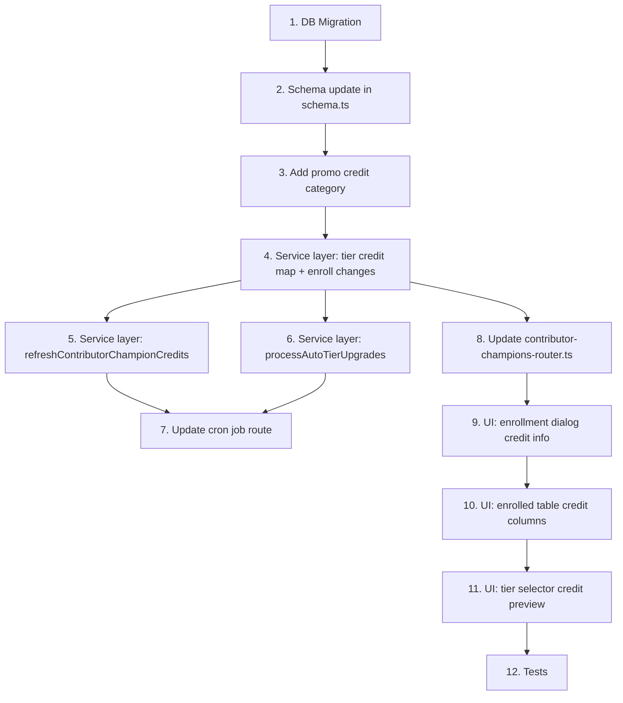

# Contributor Champion Credits — Implementation Plan

## Overview

Add monthly Kilo Credits to the contributor champions feature, modeled after the existing OSS sponsorship monthly credit reset system. Credits are granted to the contributor's **personal Kilo account** (not an organization), expire after 30 days, and auto-refresh on a rolling 30-day cycle.

### Tier Credit Amounts

| Tier        | Monthly Credits | Auto-upgrade threshold  |
| ----------- | --------------- | ----------------------- |
| Contributor | $0/month        | 1+ merged PR in 90 days |
| Ambassador  | $50/month       | 5+ merged PRs all-time  |
| Champion    | $150/month      | 15+ merged PRs all-time |

---

## 1. Database Schema Changes

### 1a. New columns on `contributor_champion_memberships`

Add three columns to track credit state — modeled after the OSS pattern of storing `oss_monthly_credit_amount_microdollars` and `oss_credits_last_reset_at` in the organization settings JSONB.

For contributor champions, we store these directly as typed columns since the memberships table is purpose-built:

```sql
ALTER TABLE contributor_champion_memberships
  ADD COLUMN credit_amount_microdollars bigint DEFAULT 0 NOT NULL,
  ADD COLUMN credits_last_granted_at timestamptz,
  ADD COLUMN linked_kilo_user_id text REFERENCES kilocode_users(id) ON DELETE SET NULL;
```

**Column details:**

- [`credit_amount_microdollars`](packages/db/src/schema.ts) — the monthly credit grant in microdollars. Derived from the tier:
  - `contributor` → `0`
  - `ambassador` → `50_000_000` ($50)
  - `champion` → `150_000_000` ($150)
- [`credits_last_granted_at`](packages/db/src/schema.ts) — timestamp of when credits were last granted. Used by the cron to determine when the next 30-day grant is due. `NULL` means credits have never been granted.
- [`linked_kilo_user_id`](packages/db/src/schema.ts) — the Kilo user who receives the credits, resolved from the contributor's commit email matched to `kilocode_users.google_user_email`. Stored explicitly so the cron doesn't have to re-resolve it every run and so we can verify linkage at enrollment time.

### 1b. Schema file update

Update the Drizzle schema definition in [`contributor_champion_memberships`](packages/db/src/schema.ts:2059) to include the three new columns.

### 1c. Migration

Create migration `0047_contributor_champion_credits.sql` with the `ALTER TABLE` statements above, plus an index:

```sql
CREATE INDEX IDX_contributor_champion_memberships_credits_due
  ON contributor_champion_memberships (credits_last_granted_at)
  WHERE enrolled_tier IS NOT NULL
    AND credit_amount_microdollars > 0;
```

---

## 2. Promo Credit Category

### 2a. Register a new credit category

Add a new entry to [`nonSelfServicePromos`](src/lib/promoCreditCategories.ts:102) in `src/lib/promoCreditCategories.ts`:

```ts
{
  credit_category: 'contributor-champion-credits',
  description: 'Contributor Champion monthly credits',
  is_idempotent: false,
  expiry_hours: 30 * 24, // 30 days = 720 hours
}
```

Using `expiry_hours: 30 * 24` means each grant automatically gets a 30-day expiry calculated at grant time via [`computeExpiryDateFromHours()`](src/lib/promotionalCredits.ts:298). This handles the "credits expire 30 days after enrollment/upgrade" requirement. When unused credits expire, the standard [`processLocalExpirations()`](src/lib/creditExpiration.ts:152) flow handles the deduction.

---

## 3. Service Layer Changes

### 3a. Tier → credit amount mapping

Add a constant map to [`service.ts`](src/lib/contributor-champions/service.ts):

```ts
const TIER_CREDIT_USD: Record<ContributorTier, number> = {
  contributor: 0,
  ambassador: 50,
  champion: 150,
};
```

### 3b. Modify `enrollContributorChampion()`

Update [`enrollContributorChampion()`](src/lib/contributor-champions/service.ts:630) to:

1. Resolve `linked_kilo_user_id` from the leaderboard row's `linkedUserId`.
2. Set `credit_amount_microdollars` based on the resolved tier.
3. If the tier has credits > $0 **and** a linked Kilo user exists:
   - Call [`grantCreditForCategory()`](src/lib/promotionalCredits.ts:73) with category `'contributor-champion-credits'`, the appropriate `amount_usd`, and `expiry_hours: 30 * 24`.
   - Set `credits_last_granted_at` to `now()`.
4. The function should accept an optional `adminUser` parameter (a `User` object) so it can call `grantCreditForCategory()` which requires a user context. The admin user making the enrollment is the logical actor.

### 3c. New function: `refreshContributorChampionCredits()`

Create a new exported function in [`service.ts`](src/lib/contributor-champions/service.ts) that the cron job will call:

```
refreshContributorChampionCredits(): Promise<CreditRefreshSummary>
```

Logic:

1. Query all enrolled memberships where:
   - `enrolled_tier IS NOT NULL`
   - `credit_amount_microdollars > 0`
   - `linked_kilo_user_id IS NOT NULL`
   - Either `credits_last_granted_at IS NULL` OR `credits_last_granted_at <= now() - 30 days`
2. For each eligible membership:
   - Fetch the `User` record for `linked_kilo_user_id`.
   - Call `grantCreditForCategory(user, { credit_category: 'contributor-champion-credits', amount_usd: tierAmount, expiry_hours: 30 * 24, counts_as_selfservice: false })`.
   - Update `credits_last_granted_at = now()` on the membership row.
3. Return a summary: total processed, granted, skipped (no user), errored.

### 3d. New function: `processAutoTierUpgrades()`

Create a new exported function for automatic tier upgrades:

```
processAutoTierUpgrades(): Promise<AutoUpgradeSummary>
```

Logic:

1. Query enrolled memberships joined with contributor stats.
2. For each enrolled contributor:
   - If `all_time_contributions >= 15` and `enrolled_tier !== 'champion'` → upgrade to `champion`.
   - Else if `all_time_contributions >= 5` and `enrolled_tier === 'contributor'` → upgrade to `ambassador`.
3. For each upgrade:
   - Update `enrolled_tier` and `credit_amount_microdollars` on the membership row.
   - The credit refresh logic will pick up the new amount on the next 30-day cycle.
   - If time since last grant is already >= 30 days, the credit refresh step that runs after this will grant the new amount immediately.
4. Return a summary.

**Important:** The auto-upgrade thresholds differ from [`getContributorTierSuggestion()`](src/lib/contributor-champions/service.ts:153) which uses `contributions90d >= 5` for ambassador. The task specifies `5+ merged PRs` for ambassador and `15+ merged PRs` for champion, both measured as **all-time** counts. This function should use `all_time_contributions` for both thresholds.

### 3e. Update `getContributorChampionLeaderboard()`

Extend the [`LeaderboardRow`](src/lib/contributor-champions/service.ts:109) type and the leaderboard query to include:

- `creditAmountUsd: number | null` — derived from `credit_amount_microdollars`
- `creditsLastGrantedAt: string | null`
- `linkedKiloUserId: string | null` — from the new column (not just the email match)

This data is needed by the admin UI to show credit status.

---

## 4. Cron Job Changes

### 4a. Extend the existing cron at [`contributor-champions-sync/route.ts`](src/app/api/cron/contributor-champions-sync/route.ts)

After the existing `syncContributorChampionData()` call, add two additional steps:

```
Step 1: syncContributorChampionData()      // existing — sync PRs from GitHub
Step 2: processAutoTierUpgrades()           // new — upgrade tiers based on merged PR counts
Step 3: refreshContributorChampionCredits() // new — grant monthly credits to eligible champions
```

The order matters: sync first (so PR counts are current), then upgrade tiers (so credit amounts reflect the latest tier), then grant credits.

Return all three summaries in the response JSON.

### 4b. Cron schedule

The existing cron already runs on a schedule. No schedule change needed — the 30-day rolling logic is checked per-member via `credits_last_granted_at`, so the cron can run daily (or however often it's scheduled) and only grants when 30 days have elapsed for each individual member.

---

## 5. API Route Changes

### 5a. Update the `enroll` mutation

In [`contributor-champions-router.ts`](src/routers/admin/contributor-champions-router.ts:55), the `enroll` mutation needs to:

1. Pass the admin user (`ctx.user`) to the updated `enrollContributorChampion()` function so credits can be granted on enrollment.
2. Return the credit amount in the response so the UI can show a confirmation message.

Updated signature:

```ts
enroll: adminProcedure
  .input(
    z.object({
      contributorId: z.string().uuid(),
      tier: TierSchema.nullable().optional(),
    })
  )
  .mutation(async ({ input, ctx }) => {
    const result = await enrollContributorChampion({
      contributorId: input.contributorId,
      tier: input.tier ?? null,
      adminUser: ctx.user,
    });
    return {
      success: true,
      enrolledTier: result.enrolledTier,
      creditAmountUsd: result.creditAmountUsd,
      creditGranted: result.creditGranted,
    };
  });
```

### 5b. Return credit info in leaderboard/enrolled list

The existing `leaderboard` and `enrolledList` queries already return from [`getContributorChampionLeaderboard()`](src/lib/contributor-champions/service.ts:487) and [`getEnrolledContributorChampions()`](src/lib/contributor-champions/service.ts:666). With the LeaderboardRow extension from step 3e, credit data will automatically flow through.

---

## 6. UI Changes

### 6a. Enrollment confirmation dialog

Update the enrollment dialog in [`page.tsx`](src/app/admin/contributors/page.tsx:1060) to show credit information:

**Current:**

> Enroll @username as **ambassador**.

**Proposed:**

> Enroll @username as **ambassador**.
>
> **Ambassador tier: $50/month in Kilo Credits** will be added to the person's Kilo account and renew every month.

For `contributor` tier (no credits), show:

> Enroll @username as **contributor**.
>
> Contributor tier receives no monthly credits.

If the contributor has no linked Kilo account, show a warning:

> ⚠️ No linked Kilo account found. Credits cannot be granted until the contributor has a Kilo account with a matching email.

### 6b. Enrolled table — add credit columns

Add columns to the Enrolled table:

| Column       | Description                                                     |
| ------------ | --------------------------------------------------------------- |
| Credits/mo   | e.g. "$50" or "—" for contributor tier                          |
| Last Grant   | e.g. "2025-02-15 12:00" or "Never"                              |
| Kilo Account | Already effectively shown via the email link + AlertCircle icon |

### 6c. Tier selector credit preview in review queue

When selecting a tier in the review queue, display the credit amount below the selector as a hint, e.g. "→ $50/mo in credits".

---

## 7. Implementation Order



### Detailed step order:

1. **DB Migration** — create `0047_contributor_champion_credits.sql`
2. **Schema update** — add columns to `contributor_champion_memberships` in `packages/db/src/schema.ts`
3. **Promo credit category** — add `'contributor-champion-credits'` to `src/lib/promoCreditCategories.ts`
4. **Service: core enrollment** — update `enrollContributorChampion()` with credit granting + new columns, add `TIER_CREDIT_USD` map, update `LeaderboardRow` type and leaderboard query
5. **Service: credit refresh** — implement `refreshContributorChampionCredits()`
6. **Service: auto-upgrade** — implement `processAutoTierUpgrades()`
7. **Cron job** — extend `contributor-champions-sync/route.ts` to call auto-upgrade + credit refresh
8. **Router** — pass `ctx.user` to enroll, return credit info
9. **UI: enrollment dialog** — show credit amount and warnings
10. **UI: enrolled table** — add credit columns
11. **UI: tier preview** — add credit hint to tier selector in review queue
12. **Tests** — add tests to `service.test.ts` for credit granting, refresh, auto-upgrade, and edge cases

---

## Key Design Decisions

### Credits go to personal accounts, not organizations

Unlike OSS sponsorships which grant credits to an **organization**, contributor champion credits go to the contributor's **personal Kilo account**. This means we use [`grantCreditForCategory(user, ...)`](src/lib/promotionalCredits.ts:73) (the user-level wrapper), not `grantEntityCreditForCategory()` with an organization.

### Rolling 30-day cycle per member

Each contributor has their own independent 30-day cycle tracked by `credits_last_granted_at`. This is simpler than a global monthly reset and matches the "rolling 30-day refresh" requirement.

### Credit expiration is handled by the existing system

By setting `expiry_hours: 30 * 24` on the credit grant, the standard [`processLocalExpirations()`](src/lib/creditExpiration.ts:152) system handles expiry automatically. Old credits expire, new ones are granted — purchased credits are never touched.

### Auto-upgrade uses all-time contributions

The task specifies `5+ merged PRs → Ambassador` and `15+ merged PRs → Champion`. These are all-time thresholds, not rolling windows. This is stored in [`all_time_contributions`](packages/db/src/schema.ts:2010) on the contributors table.

### `linked_kilo_user_id` is resolved at enrollment and refreshed by cron

At enrollment time, we resolve the contributor's commit email → Kilo user. If no match exists, we store `NULL` and skip credit granting. The cron can attempt to re-resolve unlinked contributors on each run by checking for new email matches.
